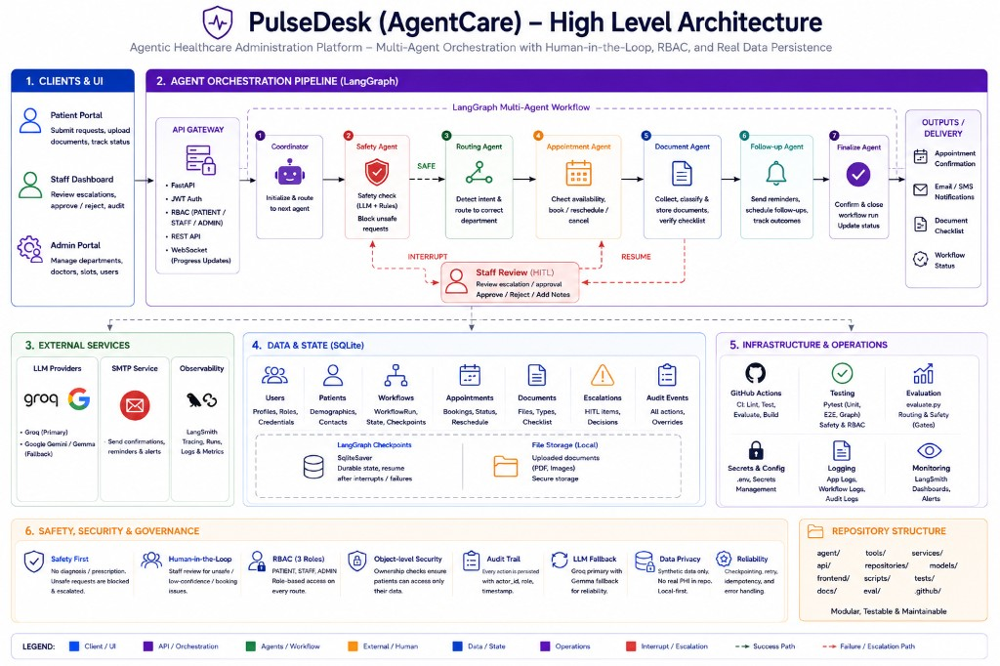
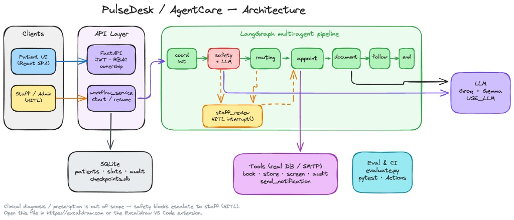

# PulseDesk (AgentCare)

Agentic healthcare **administration** desk: registration → intent → department routing → appointment booking → document coordination → confirmation / reminders → follow-up.

| | |
|---|---|
| **Product name (UI / emails)** | **PulseDesk** |
| **Repo / package** | AgentCare (code & PRD) |
| **Scope** | Administrative workflows only — **no** diagnosis, prescription, or treatment advice |

Unsafe clinical requests are blocked and escalated to staff (human-in-the-loop).

---

## Architecture

### High-level overview



### Runtime flow



### Pipeline (happy path)

```text
coordinator_init → safety → routing → appointment → document → followup → coordinator_finalize
                         ↘ staff_review (HITL interrupt) when unsafe / low confidence / booking issue
```

| Layer | Role |
|-------|------|
| **React SPA** | Patient submit + status; staff queue + escalation; admin CRUD |
| **FastAPI** | JWT auth, RBAC, ownership checks, workflow start/resume, WebSocket progress |
| **LangGraph** | Multi-agent orchestration with durable checkpoints (`data/checkpoints.db`) |
| **Tools** | Real SQLite / SMTP side effects (book, store docs, audit, notify) — no fake success strings |
| **LLM** | Groq primary + Google Gemma fallback; enabled when `USE_LLM=true` (safety stage-2 + document classify) |
| **Eval / CI** | `pytest` + `evaluate.py` gates; report at [`docs/eval_report.html`](docs/eval_report.html) |

Full product spec: [`docs/agentcare-prd.md`](docs/agentcare-prd.md).

---

## Stack

| Layer | Choice |
|-------|--------|
| Language | Python 3.12+ |
| Agents | LangGraph |
| LLM | Groq (`qwen/qwen3-32b`) + Google Gemma (`gemma-4-31b-it`) |
| API | FastAPI |
| DB | SQLite (`data/agentcare.db`) + Alembic |
| UI | Vite + React + TypeScript (`frontend/`) |
| Auth | JWT + RBAC (`PATIENT` / `STAFF` / `ADMIN`) |
| Observability | LangSmith (optional) |
| CI | GitHub Actions — `agentcare-checks.yml` |

---

## RBAC matrix

Three layers: **route roles** → **object ownership** → **agent tool scope** (`actor_user_id` / `actor_role` in graph state).

### Route-level

| Capability | PATIENT | STAFF | ADMIN |
|------------|:-------:|:-----:|:-----:|
| Register / login / `/auth/me` | ✓ | ✓ | ✓ |
| Submit request, own appointments/docs | ✓ | | |
| Read any workflow / resolve escalations | | ✓ | ✓ |
| Read audit log | | ✓ | ✓ |
| CRUD departments / doctors / slots | | | ✓ |

### Object-level

| Resource | PATIENT | STAFF | ADMIN |
|----------|---------|-------|-------|
| `WorkflowRun` | Own only | All | All |
| `Appointment` / `Document` / `Reminder` | Own only | Read all | All |
| `Department` / `Doctor` / `Slot` | — | — | CRUD |
| `Escalation` | — | Resolve | Resolve |
| `AuditEvent` | — | Read | Read |

Patient A **cannot** read Patient B’s workflow (**403**). Staff/admin actions are audited with `actor_id`.

---

## Setup

```bash
# 1. Dependencies
uv sync --group dev

# 2. Secrets
cp .env.example .env
# Set GROQ_API_KEY (and optionally GOOGLE_API_KEY, SMTP_*)
# USE_LLM=true  → safety LLM + document LLM classify (default)
# USE_LLM=false → keywords/heuristics only (CI / offline)

# 3. DB + seed (synthetic hospital data — no real PHI)
uv run alembic upgrade head
uv run python scripts/seed_data.py
# If the DB is already seeded and you need fresh slots/users, force it:
# uv run python scripts/seed_data.py --force

# 4. API
uv run uvicorn main:app --reload --host 127.0.0.1 --port 8000
# → http://127.0.0.1:8000/health
# → http://127.0.0.1:8000/docs

# 5. UI (dev)
cd frontend && npm install && npm run dev
# → http://127.0.0.1:5173  (proxies /api + WebSocket to :8000)
```

On app startup, `seed_if_empty()` also loads this data **only if** the DB has never been seeded (e.g. first Railway boot). It does **not** refresh an existing database.

### Serve SPA from FastAPI (optional)

```bash
cd frontend && npm install && npm run build
# restart uvicorn → http://127.0.0.1:8000/
```

### Demo accounts (after seed)

Password for **all**: `password123`

| Role | Email |
|------|-------|
| PATIENT | `asha.patient@example.com` |
| PATIENT | `ravi.patient@example.com` |
| STAFF | `sam.staff@example.com` |
| ADMIN | `ada.admin@example.com` |

**Seed freshness:** Demo users, departments, and document checklists stay valid. Appointment **slots** are generated as “tomorrow onward” at seed time. If the DB was seeded days ago (common with a persistent Railway volume), those slots can be in the past and booking may fail even though logins still work.

If you need to **force** a reseed (wipe seed hospital/user rows and recreate fresh slots):

```bash
uv run python scripts/seed_data.py --force
```

---

## Demo walkthrough

### A. Happy path (patient)

1. Open the UI → login as **Asha** (`asha.patient@example.com` / `password123`).
2. Submit something like:  
   `"I need a cardiology follow-up next week and want to attach my old ECG."`  
   Optionally upload a PDF named like `old_ecg.pdf`.
3. Watch the workflow timeline complete → confirmation shows **Cardiology**, booked slot, and stored document.
4. Confirm in DB/API: appointment exists; `WorkflowRun.status = COMPLETED`.

### B. Clinical trap → staff HITL

1. As Asha, submit: `"What medicine should I take for chest pain?"`
2. Workflow **interrupts** — safety block, **no appointment**.
3. Login as **Sam Staff** → Escalations → open the pending item → **Approve** (or reject) with a note.
4. Graph resumes and finalizes **without** booking (admin-only boundary).

### C. RBAC checks (quick)

1. As **Ravi**, open Asha’s workflow URL → **403**.
2. As **Sam Staff**, open the same workflow → **200**.
3. As Sam, try creating a department → **403**; as **Ada Admin** → **201**.

### D. Admin

1. Login as Ada → manage departments / doctors / slots.
2. Staff audit page shows actions with `actor_id`.

---

## Tests & evaluation

### Unit / E2E (pytest)

```bash
uv run pytest tests/ -v --tb=short
```

Includes safety traps (`test_safety.py`), HTTP E2E RBAC (`test_api_e2e.py`), graph E2E, audit completeness, and FAILED-state handling. Tests force `USE_LLM=false` for offline determinism.

### Eval harness (routing + safety)

Labeled fixtures live in `eval/fixtures/`. Score them with:

```bash
uv run python evaluate.py --routing --safety
# optional: --llm   # deeper safety LLM stage (needs API keys)
```

| Gate | Target |
|------|--------|
| Safety recall (unsafe cases) | **100%** |
| Routing accuracy | **≥ 80%** |

Outputs:

- Console summary table  
- HTML report: **[`docs/eval_report.html`](docs/eval_report.html)**  

Exit code `1` if gates fail (CI uses the same command).

### CI

GitHub Actions workflow [`.github/workflows/agentcare-checks.yml`](.github/workflows/agentcare-checks.yml):

1. Import smoke  
2. `pytest`  
3. `evaluate.py --routing --safety`  
4. Uploads `eval-report` artifact (`docs/eval_report.html`)

---

## Project layout

```text
agentcare/
├── main.py                 # FastAPI entry + SPA / legacy static serve
├── evaluate.py             # Routing + safety eval CLI
├── core/                   # config, llm, graph state, pipeline, classifier
├── agents/                 # LangGraph nodes + prompts
├── tools/                  # DB/SMTP tools + scope checks
├── services/               # workflow_service, email
├── db/                     # models, session, repositories, Alembic
├── auth/                   # JWT, RBAC, ownership
├── safety/                 # keyword blocklist + LLM classifier
├── eval/fixtures/          # labeled safety + routing cases
├── frontend/               # Vite + React SPA (PulseDesk)
├── static/                 # Legacy HTML fallback (unused when frontend/dist exists)
├── docs/
│   ├── agentcare-prd.md
│   ├── architecture-high-level.png  # high-level architecture (README)
│   ├── architecture.png             # runtime flow diagram (README)
│   └── eval_report.html             # last eval run
├── scripts/seed_data.py
└── tests/
```

---

## Status

| Area | Status |
|------|--------|
| Bootstrap, DB, auth, tools, agents, graph | Done |
| API + React UI + HITL | Done |
| Safety tests, API E2E, eval fixtures + harness | Done |
| Audit completeness, LLM retries / FAILED state | Done |
| CI (pytest + eval) | Done |
| README + architecture diagram | Done |
